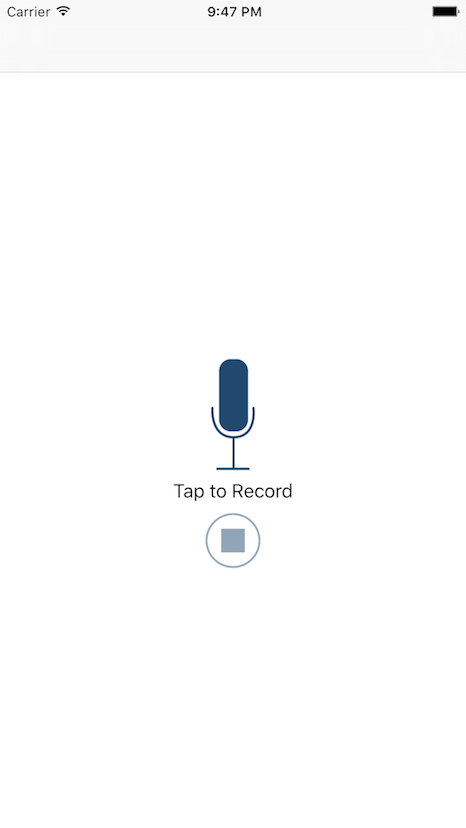
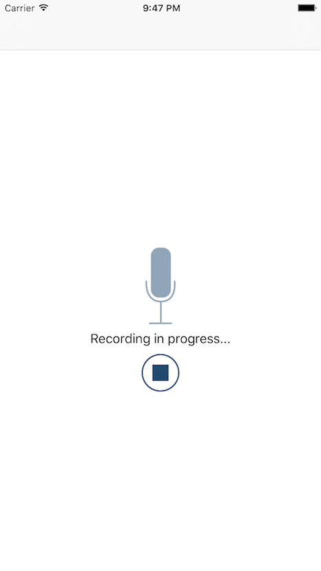
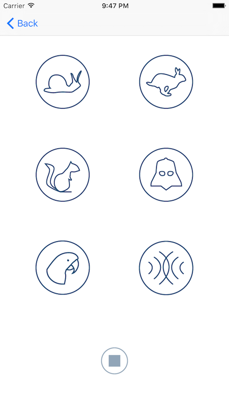

## PitchPerfect

###### Intro to iOS App Development with Swift
<https://www.udacity.com/course/intro-to-ios-app-development-with-swift--ud585>

#### Summary

In this course we will build an iPhone app that records a conversation between you and a friend, and then makes your voices sound like a Chipmunk or Darth Vader.

This course will introduce you to iOS app development in Swift, a new programming language from Apple, and serves as your launching point into the iOS Developer Nanodegree.

#### Syllabus

| Lesson | Topics |
|:----:|--------|
| 1 | Introduction and Xcode |
| 2 | AutoLayout and Buttons |
| 3 | ViewController & Multiple Views |
| 4 | Delegation and Recording |
| 5 | Playback and Effects |

#### Screenshots

